# ReLive Data Logging - Unity Client

The ReLive logging framework provides a data format for the logging of Mixed Reality studies. This Unity client simplifies the logging of studies in the provided data format.

## Setup

Copy the files from the `Assets` folder into your own Unity project. If the plugins (in `Assets/Plugins`) are already part of your Unity project it is not necessary to copy them again (e.g., in newer Unity versions `Newtonsoft.Json.dll` is no longer needed and should be removed from the folder).

## Usage

Drag the prefabs `[Loggers]` and `[SessionController]` from the `Assets/ReLive/Prefabs` folder into your scene(s).

### Loggers

Inside the `[Loggers]` prefab are three Loggers: `[WebLogger]`, `[FileLogger]`, and `[DebugLogger]`. To use (or not use) a logger simply enable (or disable) it.

#### Web Logger

The web logger sends all captured data to a server where it will be stored in a database. You must provide a `Study Name` so that your study data can be distinguished from other study data.

#### File Logger

The file logger saves all captured data on the device using JSON files. The files will be save at the provided `Filepath`. When enabling the option `Use Relative Persistent Path` the provided `Filepath` is set relative to [`Application.persistentDataPath`](https://docs.unity3d.com/ScriptReference/Application-persistentDataPath.html). The option `Use Date As Folder Name` creates for every session a new folder. This option should only be disabled when the `Filepath` is manually changed (by code) between sessions. Otherwise previous data will be overwritten!

#### Debug Logger

The debug logger does not store the data persistent but only outputs the logged data on the console. As the name suggests, it is intended for debugging purposes only. **Attention:** This logger should not be enabled when using `[LogCapture]` because the combination will generate an endless loop that will freeze the application (also the Unity Editor).

### Session Controller

The session controller manages the start, stop and metadata (name, description) of sessions. Sessions can be started and stopped by calling the methods `StartSession` and `StopSession` (or pressing the buttons in the editor). The option `Auto Start Session` automatically starts the session when the application is started. Started sessions will automatically stopped when the application is closed. The `sessionId` of a session can be automatically generated (by enabling the `Auto Generate Session Id` option) or manually set by the `SessionId` field before starting the session. Furthermore, before starting the session the session name and description can be set by the fields `SessionName` and `SessionDescription`. When no session name is specified, the session will be named with the date ("Session @ {date}").

### Logging Objects

The Unity client provides different scripts to log the position, rotation, scale, and further attributes of objects. To follow ...

#### 3D Objects

Add the `TracedGameObject` script to the 3D object. To follow ...

##### Custom Properties

Add `[Traced]` above a variable of a script. The GameObject of the script needs a `TracedEntity` attached (e.g., `TracedGameObject`, `TracedScreenObject`). To follow ...

#### Screen Objects

Add the `TracedScreenObject` script to the screen object. To follow ...

#### Camera

Add the `TracedCamera` script to the camera. To follow ...

### Logging Events

The Unity client provides different possibilites to log different types of events. Here is an example of an event call:

```
string attribute1 = "Hi";
int attribute2 = 12;
ReliveEvent.Log(ReliveEventType.Custom, new Dictionary<string, object>
{
    { "attribute1", attribute1 },
    { "attribute2", attribute2 }
});
```

This results in the following event:

```
{"attribute1":"Hi","attribute2":12,"eventId":"963561da-cd63-4025-a798-5b0814628fc9","sessionId":"045da738-3b1b-4b41-9de7-3172bce02198","timestamp":1647961045997,"eventType":"custom"}
```

To follow ...

#### Button Events (currently only click)

Add the `TracedButtonEvents` script to the button. To follow ...

#### Unity Log Messages

Add the `[LogCapture]` prefab to the scene. To follow ...

## Data Format

The data format differentiates between four types of logging messages: **Sessions**, **Entities**, **Events**, and **States**. Each application can have multiple sessions. Each session can have multiple entities and events. Each entity (or event) can have multiple states. Sessions are self-contained and can represent a single study session or a condition of a study session since they contain all related data.

```mermaid
classDiagram
    Session "1" <|-- "*" Event
    Session "1" <|-- "*" Entity
    Event "1" <|-- "*" State
    Entity "1" <|-- "*" Statê
```



### Session

Sessions divide the data into subsets and can be used to describe, e.g. a **study session** (e.g., "P1"), **condition** (e.g., "P1C1") or **repetition** (e.g.,"P1R1", "P1C1R1") of a study.

| Value | Description |
| ------ | ------ |
| `sessionId` | The id of the session. |
| `startTime` | The start timestamp of the session as "Unix Epoch Time" in milliseconds.  |
| `endTime` | The end timestamp of the session as "Unix Epoch Time" in milliseconds. |
| `name` | *(optional)* The name of the session. |
| `description` | *(optional)* The description of the session. |

### Entity

Entities are all (virtual or physical) elements that are relevant for the logging of the study. For example a **3D object** or a **camera** in a Mixed Reality study is an entity.

| Value | Description |
| ------ | ------ |
| `entityId` | The id of the entity. |
| `parentEntityId` | *(optional)* The id of the parent entity (e.g. when a 3D object has a parent 3D object). |
| `sessionId` | The id of the session the entity belongs to. |
| `entityType` | Describes the type of entity: `object`, `video`, `audio`, ... | 
| `name` | The display name of the entity. Passing the name of an entity simplifies later evaluation. | 
| `space` | Every entity is part of one of the following spaces: `screen`, `world`, `none`. E.g. a 3D object would be part of the `world` space, an user interface element part of the `screen` space, and a video recording has no space: `none`. |
| ... |  |

### Event

Events are message objects that are not directly related to the characteristics of the entites in the scene. Therefore they are often used to describe **actions** that can not be described by state messages.

| Value | Description |
| ------ | ------ |
| `eventId` | The id of the event. |
| `entityIds` | *(optional)* The ids of the entities that triggers the event. |
| `sessionId` | The id of the session the event belongs to. |
| `eventType` | Describe the type of event: `videoStart`, `videoEnd`, `click`, `touch`, `log`, `criticalIncident`, ... |
| `timestamp` | The timestamp of the event as "Unix Epoch Time" in milliseconds. |
| `message` | *(optional)* A message describing the event. |
| ... |  |

### State

States describe the **state** of an entity (or event) **at a given time**. Therefore a state is similar to a line in a common logging file.

| Value | Description |
| ------ | ------ |
| `parentId` | The id of the entity or event the state describes. |
| `sessionId` | The id of the session the state belongs to. |
| `stateType` | Describe the type of state: `entity`, `event`.
| `timestamp` | The timestamp of the state as "Unix Epoch Time" in milliseconds. |
| `status` | *(optional)* The status can be `active`, `inactive`, or `deleted`. |
| `position` | *(optional)* The `x`, `y`, and `z` position as float. The `z` value is optional. |
| `rotation` | *(optional)* The rotation as quaternion. The expected values of the quaternion are `x`, `y`, `z`, and `w` as float. |
| `scale` | *(optional)* The `x`, `y`, and `z` value of the scale as float. The `z` value is optional. |
| `color` | *(optional)* The color as hexadecimal value. E.g. `#00bfff`, `#aa00bfff`, `#0000FF` |
| ... |  |
