# ReLive Server

The goal of the ReLive Server is to provide a holistic toolkit for HCI studies. In the future, the toolkit will support researchers from study planning and acquisition of participants to study execution and analysis. This repository contains the server side of the toolkit.

## Data Logging

The toolkit provides a logging protocol. The use of the logging protocol allows an easier analysis of the data after the study (or even during the study) because the different tools of the toolkit can be used. For example, the entire study can be replayed in 3D (Relive study data) or standard calculations can be performed automatically.

### Messages

The logging protocol differentiates between four types of logging messages: Entities, States, Events, and Sessions. The following diagram illustrates the structure of the data format. The arrows indicate the relations between the different messages. Each application can have multiple sessions. Each session can have multiple entities and events. Each entity or event can have multiple states. Sessions are self-contained and can represent a single study session or a condition of a study since they contain all related data.

```mermaid
classDiagram
    Session "1" <|-- "*" Event
    Session "1" <|-- "*" Entity
    Event "1" <|-- "*" State
    Entity "1" <|-- "*" Statê
```

#### Session

Sessions divide the data into subsets and can be used to describe, e.g. conditions or repetitions of a study.

| Value | Description |
| ------ | ------ |
| `sessionId` | The id of the session. |
| `startTime` | The start timestamp of the session as "Unix Epoch Time" in milliseconds.  |
| `endTime` | The end timestamp of the session as "Unix Epoch Time" in milliseconds. |
| `name` | *(optional)* The name of the session. |
| `description` | *(optional)* The description of the session. |

#### Entity

Entities are all virtual or physical elements that are relevant for the logging of the study. For example a 3D object in a Mixed Reality study or a button of a user interface is an entity.  But also a physical camera or an eye tracker recording the study are entities. The described values can be extended in the future. Custom values can be appended to meet the individual needs.

| Value | Description |
| ------ | ------ |
| `entityId` | The id of the entity. |
| `parentEntityId` | *(optional)* The id of the parent entity (e.g. when a 3D object has a parent 3D object). |
| `sessionId` | The id of the session the entity belongs to. |
| `entityType` | Describes the type of entity: `object`, `video`, `audio`, ... | 
| `name` | The display name of the entity. Passing the name of an entity simplifies later evaluation. | 
| `space` | Every entity is part of one of the following spaces: `screen`, `world`, `none`. E.g. a 3D object would be part of the `world` space, an user interface element part of the `screen` space, and a video recording has no space: `none`. |
| `attachments` |  *(optional)* Attachments (i.e., large external blobs) that are related to the entity. For example the file path of a 3D object (e.g. `example.obj`), an user interface element (e.g. `button.png`), or a video recording (e.g. `recording.mp4`). |
| ... |  |

#### Attachment

! Warning: Attachments need further revision and will be changed in the future !

| Value | Description |
| ------ | ------ |
| `id` | The id of the attachment. |
| `type` | 'video', 'model', 'screenshot'. Server also accepts 'rtsp', which will be converted to 'video'. |
| `content` | Actual content of the attachment. Empty if the `contentType` is `'persistent'`. |
| `contentType` | `'persistent'` if the content is stored on the server; `'attached'` if the content can be directly accessed in the `content` field |
| ... |  |

#### Event

Events are message objects that are not directly related to the characteristics of the entites in the scene. Therefore they are often used to describe actions of entities that can not be described by state messages. The described values can be extended in the future. Custom values can be appended to meet the individual needs.

| Value | Description |
| ------ | ------ |
| `eventId` | The id of the event. |
| `entityIds` | *(optional)* The ids of the entities that triggers the event. |
| `sessionId` | The id of the session the event belongs to. |
| `eventType` | Describe the type of event: `videoStart`, `videoEnd`, `click`, `touch`, `log`, `criticalIncident`, ... **(to be further defined)** |
| `timestamp` | The timestamp of the event as "Unix Epoch Time" in milliseconds. |
| `message` | *(optional)* A message describing the event. |
| ... |  |

#### State

States describe the state of an entity or event at a given time. Therefore a state is similar to a line in a common logging file. States can be sent permanently (e.g. per frame, event, interval) or only when a value changes (to reduce the impact of logging on system performance). The described values can be extended in the future. Custom values can be appended to meet the individual needs.

| Value | Description |
| ------ | ------ |
| `parentId` | The id of the entity or event the state describes. |
| `sessionId` | The id of the session the state belongs to. |
| `stateType` | Describe the type of state: `entity`, `event`.
| `timestamp` | The timestamp of the state as "Unix Epoch Time" in milliseconds. |
| `status` | *(optional)* The status can be `active`, `inactive`, or `deleted`. |
| `position` | *(optional)* The `x`, `y`, and `z` position as float. The `z` value is optional. |
| `rotation` | *(optional)* The rotation as quaternion. The expected values of the quaternion are `x`, `y`, `z`, and `w` as float. |
| `scale` | *(optional)* The `x`, `y`, and `z` value of the scale as float. The `z` value is optional. |
| `color` | *(optional)* The color as hexadecimal value. E.g. `#00bfff`, `#aa00bfff`, `#0000FF` |
| ... |  |

### Database

The server uses MongoDB as storage for the logged data. Each application generates its own database in MongoDB. Every database consists of the collections: `sessions`, `entities`, `states`, and `events`. The database has the following structure:

| MongoDB | | | | | | | | |
| ------ | ------ | ------ | ------ | ------ | ------ | ------ | ------ | ------ |
| Database | Example Application 1 | | | | Example Application 2 |
| Collections | sessions | entities | states | events | sessions | entities | states | events |

### File format

Sometimes there is no possibility to connect to a database during the study (e.g., in-the-wild studies). Furthermore, the data in the database can not be shared easily with others (running database server needed). Therefore, the data can also be saved as a JSON file. A file can contain several sessions or only one session. Thus, the session field is optional. The structure of the JSON file is as follows:

| Value | Description |
| ------ | ------ |
| `entities` | Array of all entities |
| `states` | Array of all states. |
| `events` | Array of all events. |
| `sessions` | *(optional)* Array of all sessions. |

#### JSON

    {
        "entities": [],
        "states": [],
        "events": [],
        "sessions": []
    }
